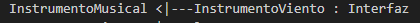

# Tutorial
- **3 herramientas utilizadas en la práctica 9**

---
## Marp for VS Code
- *Instalar la extensión*
    - Abrir Visual Studio Code.
    - Ir a la pestaña de "Extensions" en la barra lateral izquierda.
    - Buscar "Marp" en la barra de búsqueda y seleccionar la extensión Marp for VS Code.
    - Hacer clic en "Install"  para instalar.
- *Crear un nuevo archivo Markdown*
    - Crear un nuevo archivo Markdown  (con extensión .md) en Visual Studio Code
---
#### Sintaxis de Marp
- Para las diapositivas: Utilizamos tres guiones - para separar diapositivas
- Para los títulos de diapositivas: Para agregar títulos a las diapositivas usamos un signo '#'
    - Depende el tamaño del título se usan varios signos '#'
---
- Para los diferentes tipos de letra se agregan de la siguiente manera 

---
- Para agregar imagenes se guarda la imagen en la carpeta donde se esta elaborando la presentacion, y para agregarla utilizamos la forma ''
- Para comentar se utiliza la siguiente forma '[comment]: <> (This is a comment, it will not be include)'
---
- Para agregar una tabla se escribe de la siguiente manera

---
#### Guardar las diapositivas elaboradas 
- Pulsamos en el ícono que apararece en la parte superior derecha 

- Después pulsamos en dónde dice exportar 

---
- Nos abrira el explorador de archivos en la carpeta donde estamos realizando las diapositivas
- Se puede descargar de diversas formas, en nuestro caso usamos PDF

---
## Markmap
- *Instalar la extensión*
    - Utilizamos la misma forma que al instalar Marp for VS Code
- *Crear un nuevo archivo Markmap*
    - Crear un nuevo archivo Markdown  (con extensión .md) en Visual Studio Code
---
#### Sintaxis de Markmap
- Se escribe un texto de la siguiente manera 

---
- Para visualizarlo en manera de mapa mental:
- Nos vamos a la parte superior derecha presionando el ícono que tiene forma de tridente

---
- Se vera de la siguiente forma

---
#### Descargar el mapa mental
- Para descargar el mapa, nos vamos a la parte inferior derecha, dónde dice 'Export'.

---
- Se abrira el explorador de archivos en la carpeta donde estamos realizando el proyecto. Se exportara en un archivo HTML.

- Podremos ver el archivo en nuestro navegador.
---
## PlantUML
- *Instalar la extensión*
    - Utilizamos la misma forma que al instalar Marp for VS Code
- *Crear un nuevo archivo PlantUML*
    - Crear un nuevo archivo Markdown  (con extensión .md) en Visual Studio Code
---
#### Sintaxis de PlantUML
- Agregamos al inicio el siguiente texto '@startuml scale 3'
- Para crear diagramas UML se utiliza la siguiente sintaxis: 

---
- Para imprimir se escribe lo siguiente: 

---
- Nosotros escribimos una clase abstracta y después ciertas clases, de la siguiente manera:

---
- Para imprimir esa sintaxis, la imprimimos de la siguiente manera: 

---
- Para poner que era una interfaz solo escribimos ': Interfaz' después del método, por ejemplo: 

- Al final de todo lo que escribimos agregamos '@enduml'
---
#### Visualizar el diagrama UML
- Nos dirigimos a la parte superior izquierda, en el apartado 'View'

---
- Nos saldra los siguiente y seleccionaremos 'Command Palette'

---
- Seleccionamos 'Preview current PlantUML code'

---
- El diagrama se visualizara de la siguiente manera

